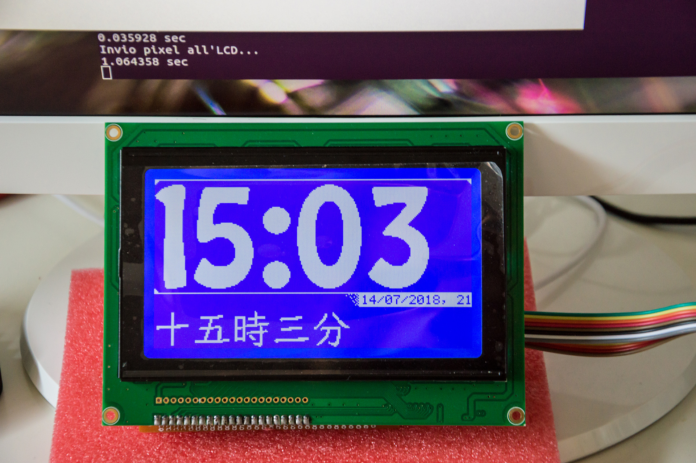

# Orologio
Simple clock that use a 240x128 Blue Graphic LCD Module Display and T6963 Controller. 



At the moment the code is an early alpha version, so, no optimization and no clean code rules are applied!

Anyway the core (class `LCD240x128`) are clean and optimized because I need the maximum speed possible to send 
data to the display and only the region that I need to update are drawn.

The code is compiled on a Raspberry PI B+ v1.2. You need the following library:
 1. [ImageMagick](https://www.imagemagick.org/script/download.php) to load images used to render big character.
 2. [bcm2835](http://www.airspayce.com/mikem/bcm2835/index.html) to send data trough the GPIO.

To show the performance I draw a random value of temperature, atmospheric pressure and humidity.

#### Compile
```
gcc -v -o orologio orologio.cpp OraBigFont.cpp JPFont.cpp LCD240x128.cpp RPI.cpp -L/usr/local/lib -lbcm2835 -lstdc++ -lrt -O `GraphicsMagick-config --cppflags --ldflags --libs`
```
#### Run
```
sudo ./orologio
```
or
```
sudo ./orologio <the-path-for-images>/<your-image>
```

Even if you can give any image supported by ImageMagick library, the code will send to the LCD only the red channel and 
the pixel will activate only if the value is greater than 240 (`R>240`).

You can see a demonstration video on Youtube: [video 1](https://youtu.be/Gx2k5jf5Tk0) and [video 2](https://youtu.be/qtPE0LozAk4) 